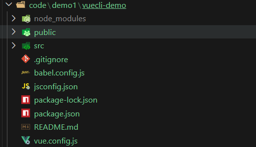
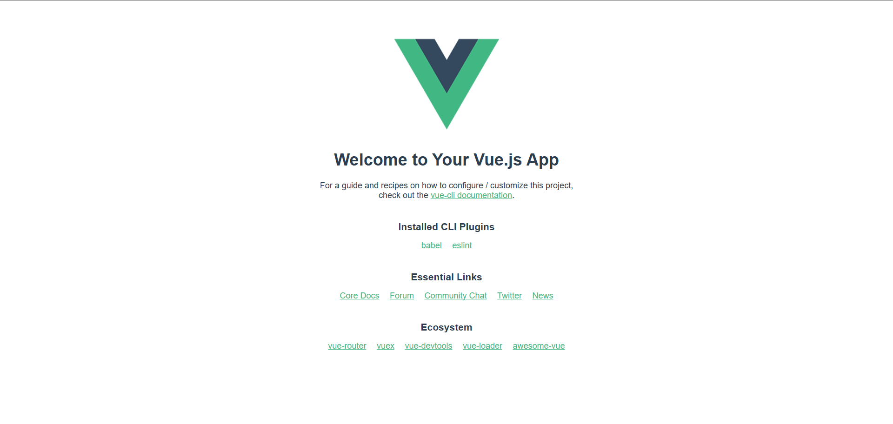
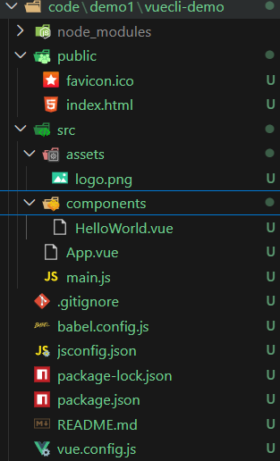
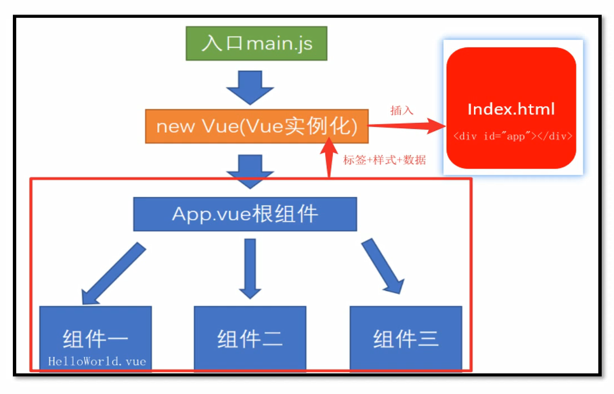

# 脚手架环境介绍  
-  @vue/cli是Vue官方提供的一个全局模块包(得到vue命令),此包用于创建脚手架项目
```bash
yarn global add @vue/cli

#或者
npm i @vue/cli -g #我这里用的还是npm,是为了统一环境管理
```

## 补充之yarn
```bash
npm install -g yarn
```
| 功能 | npm | Yarn |
|------|-----|------|
| 安装所有依赖 | `npm install` | `yarn` 或 `yarn install` |
| 安装包（生产依赖） | `npm install lodash` | `yarn add lodash` |
| 安装开发依赖 | `npm install -D eslint` | `yarn add -D eslint` |
| 卸载包 | `npm uninstall lodash` | `yarn remove lodash` |
| 全局安装 | `npm install -g vue-cli` | `yarn global add vue-cli` |
| 运行脚本（如 `scripts: { "dev": "..." }`） | `npm run dev` | `yarn dev`（可省略 `run`）|


## @vue/cli创建项目  

1. 创建项目
```bash  
vue create vuecli-demo (注意项目名不能有中文和特殊符号)
```

2. 选择模板和包管理器,等待脚手架项目创建完毕  

暂时选vue2,因为部分理念和vue3是相通的,之后会再学vue3
```bash
Vue CLI v5.0.9
? Please pick a preset: (Use arrow keys)
> Default ([Vue 3] babel, eslint)
  Default ([Vue 2] babel, eslint)
  Manually select features

```

```bash
PS D:\H5\vue\code\demo1> vue create vuecli-demo     
?  Your connection to the default npm registry seems to be slow.
   Use https://registry.npmmirror.com for faster installation? Yes


Vue CLI v5.0.9
? Please pick a preset: Default ([Vue 2] babel, eslint)


Vue CLI v5.0.9
✨  Creating project in D:\H5\vue\code\demo1\vuecli-demo.
⚙️  Installing CLI plugins. This might take a while...


added 827 packages in 2m

109 packages are looking for funding
  run `npm fund` for details
🚀  Invoking generators...
📦  Installing additional dependencies...


added 85 packages in 22s

121 packages are looking for funding
  run `npm fund` for details
⚓  Running completion hooks...

📄  Generating README.md...

🎉  Successfully created project vuecli-demo.
👉  Get started with the following commands:

 $ cd vuecli-demo
 $ npm run serve

```

这样之后就会在我们指定的目录下生成需要的文件

  
它极其方便,省去了我们之前自己手动打包的一些前置配置

2. 然后按照配置上的提示

```bash
🎉  Successfully created project vuecli-demo.
👉  Get started with the following commands:

 $ cd vuecli-demo
 $ npm run serve
```

我们运行服务
```bash
PS D:\H5\vue\code\demo1\vuecli-demo> npm run serve 

> vuecli-demo@0.1.0 serve
> vue-cli-service serve

 INFO  Starting development server...


 DONE  Compiled successfully in 79231ms                                         10:35:55


  App running at:
  - Local:   http://localhost:8080/ 
  - Network: unavailable

  Note that the development build is not optimized.
  To create a production build, run npm run build.
```

然后我们点击链接就会看到如下界面  


看到这里就成功了✅ 


**如果我们不想用默认的8080端口,我们也可以进行修改**
可以在vue.config.js中进行配置

```javascript
const { defineConfig } = require('@vue/cli-service')
module.exports = defineConfig({
  transpileDependencies: true,
  devServer:{
    port:3333, //指定端口
    open:true //指定配置完毕后自动开启 
  }
})

```
> 加上devServer的配置,这样开发模式下的端口就配置好了


```javascript
const { defineConfig } = require('@vue/cli-service')
module.exports = defineConfig({
  transpileDependencies: true
})
  
```
---  

## 脚手架文件说明 



```text
vuecli-demo/
├── node_modules/                # 第三方依赖包（npm install 安装的库）
├── public/
│   ├── favicon.ico              # 网站图标（浏览器标签页显示的小图标）
│   └── index.html               # 项目的入口 HTML 文件，会加载打包后的 JS/CSS
├── src/                         # 源码目录，所有代码都在这里
│   ├── assets/                  # 静态资源（图片、字体等）
│   │   └── logo.png             # 项目使用的图片资源
│   ├── components/              # 组件目录，存放可复用的 Vue 组件
│   │   └── HelloWorld.vue       # 示例组件，通常用于展示欢迎信息
│   ├── App.vue                  # 根组件，是整个应用的入口组件
│   └── main.js                  # 应用入口文件，创建 Vue 实例并挂载到 DOM 上
├── .gitignore                   # Git 版本控制忽略文件列表（如 node_modules）
├── babel.config.js              # Babel 配置文件，用于 JavaScript 语法转换
├── jsconfig.json                # TypeScript / JavaScript 的路径别名配置（类似 tsconfig.json）
├── package-lock.json            # npm 锁定文件，记录依赖版本号，保证环境一致
├── package.json                 # 项目配置文件：依赖、脚本命令、版本等
├── README.md                    # 项目说明文档
└── vue.config.js                # Vue CLI 的自定义配置文件（可选）
```

## 项目架构了解

  


- main.js   
```javascript
import Vue from 'vue' //引入vue对象
import App from './App.vue'//把App.vue文件引入过来(vue项目页面入口)  


Vue.config.productionTip = false //控制台提示消息

new Vue({ //开始实例化vue
  render: h => h(App),  //准备渲染App页面
}).$mount('#app')  //渲染到index.html文件id叫app的标签上

```

-  public/index.html
```html
<!DOCTYPE html>
<html lang="">
  <head>
    <meta charset="utf-8">
    <meta http-equiv="X-UA-Compatible" content="IE=edge">
    <meta name="viewport" content="width=device-width,initial-scale=1.0">
    <link rel="icon" href="<%= BASE_URL %>favicon.ico">
    <title><%= htmlWebpackPlugin.options.title %></title>
  </head>
  <body>
    <!-- 当浏览器禁用了js脚本就会提示noscript中的内容 -->
    <noscript>  
      <strong>We're sorry but <%= htmlWebpackPlugin.options.title %> doesn't work properly without JavaScript enabled. Please enable it to continue.</strong>
    </noscript>
    <div id="app"></div>
    <!-- built files will be auto injected -->
  </body>
</html>

```
--- 


## vue_eslint检查代码 

- eslint是一种代码检查的工具     

如果写代码违反了eslint的规则-报错  

演示:在main.js中随便定义变量-但是不使用它-观察eslint报错

- 譬如我们在main.js中定义一个变量 
```javascript
import Vue from 'vue'
import App from './App.vue'

Vue.config.productionTip = false

let a = 1  //定义a=1但是不使用它,然后我们的serve是开启状态的,它会自动给我们检查错误

new Vue({
  render: h => h(App),
}).$mount('#app')

```


```bash
Compiling...


 ERROR  Failed to compile with 1 error                   14:29:28

[eslint] 
D:\H5\vue\code\demo1\vuecli-demo\src\main.js
  6:5  error  'a' is assigned a value but never used  no-unused-vars

✖ 1 problem (1 error, 0 warnings)


You may use special comments to disable some warnings.
Use // eslint-disable-next-line to ignore the next line.
Use /* eslint-disable */ to ignore all warnings in a file.
ERROR in [eslint]
D:\H5\vue\code\demo1\vuecli-demo\src\main.js
  6:5  error  'a' is assigned a value but never used  no-unused-vars

✖ 1 problem (1 error, 0 warnings)


webpack compiled with 1 error
```

- 如何处理错误   

a. 手动解决错误,以后项目中会学到怎么自动解决   

b.暂时关闭eslint检查(因为目前主要精力集中在vue语法上),在vue.config.js中配置关闭检查并重启服务

```javascript
const { defineConfig } = require('@vue/cli-service')
module.exports = defineConfig({
  transpileDependencies: true,
  lintOnSave:false, //关闭eslint检查
  devServer:{
    port:3333,
    open:true,
    
  }
})


```

然后重新
```bash
npm run serve
```

发现不报错了,因为我们把eslint检查关闭了,定义了变量a但是不使用也没问题了!!!

---  


## 单vue文件开发方式介绍   

- vue推荐用.vue文件来开发项目   
- template里只能有一个根标签
- js独立作用域互不影响
- style配合scoped属性,保证样式只针对当前template内标签生效


 ### vue文件下的基础语法
App.vue
 ```html

 <!--template必须,只能有一个根标签,影响渲染到页面的标签结构-->
 <template>
      <div>欢迎使用vue</div>
 <template>

  <!--js相关-->
 <script>
  export  default{
    name:'App'
  }
 </script>

 <!--当前组件的样式,设置scoped,可以保证样式只对当前文件生效-->

 <style scoped>
  </style>


 ```

 ---      


 ## 脚手架项目_清理欢迎界面1  

 - assets和compoents文件夹下的一切都删除掉(不要默认的欢迎界面)
 - src/APP.vue默认有很多内容,可以全部删除留下template和script和style的框  
  
**可以安装一个vue  vscode  snippets插件 或者Vue 3 snippets**  

然后在清空干净的APP.vue中Vueinit  
就会自动生成如下的模板  

```html
<template lang="">
  <div>
    
  </div>
</template>
<script>
export default {
  
}
</script>
<style lang="">
  
</style>
```

---  

## 阶段小结   

- 使用前置步骤
1.  @vue/cli是一个全局模块的包名,可以用`npm  i global  @vue/cli`安装  
2. 创建需要`vue create 项目名称(不能有中文和特殊符号)`

3. 运行`npm run serve`这样就以开发模式启动了
4. 修改配置可以在vue.config.js中修改  

- 脚手架项目的好处   
开箱即用,不用再自己搞webpack

- 脚手架项目入口都有哪些?
src/main.js是项目打包入口,src所有的代码都要与main.js产生直接或间接的关系才会被一起打包  

页面入口是APP.vue  

浏览器真正运行的是public下的index.html  

- 单vue文件的好处
独立作用域,不用担心重名问题
