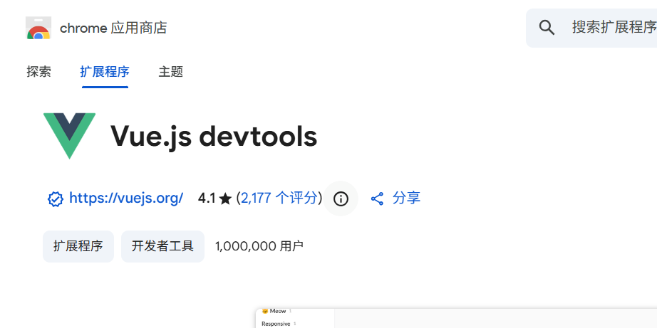
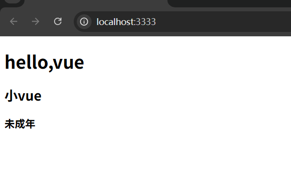
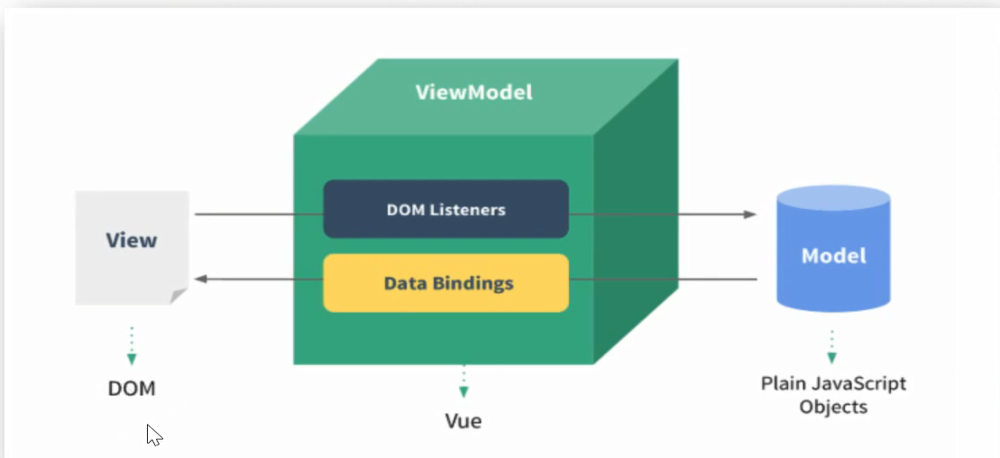

# vue指令(一)  

记得先在浏览器拓展中装一个vue-dev-tool

**解决插件在devtool不显示的问题**
在main.js中添加如下这一行

```javascript
Vue.config.devtools=true;
```
在vue.config.js中添加这一行
```javascript
const { defineConfig } = require('@vue/cli-service')
module.exports = defineConfig({
  devtool:'true', <-------❗❗❗❗❗
  transpileDependencies: true,
  lintOnSave:false, //关闭eslint检查
  devServer:{
    port:3333,
    open:true,
    
  }
})

```


## 插值表达式  
目标:在dom标签中直接插入vue数据变量   
- 又叫:声明式渲染/文本插值  
- 语法:{{表达式}}
APP.vue
```html
<template lang="">
  <div>
    <h1>{{ msg }}</h1>
    <h2>{{ obj.name }}</h2>
    <h3>{{obj.age >  18 ?  '成年':'未成年'}}</h3>
  </div>
</template>
<script>
export default {
  data(){
    return{
      msg:'hello,vue',
      obj:{
        name:'小vue',
        age:5
      }
    }
  }
}
</script>
<style lang="">
  
</style>

```
- msg和obj是vue数据变量  
- 要在js中data函数里声明
```html
<script>
export default {
  data(){
    return{
      msg:'hello,vue',
      obj:{
        name:'小vue',
        age:5
      }
    }
  }
}
</script>
```

然后我们`npm run serve`  

  

可以看到index界面渲染出来了 

## MVVM设计模式
目标:转变思维,用数据驱动视图改变,操作dom的事,vue源码内干了
- 设计模式:是一套被反复使用的、多数人知晓的、经过分类编码的、代码设计经验的总结  


--- 

## v-bind绑定属性和值  

目标:给标签属性设置Vue变量的值
- v-bind语法和简写 
  - 语法: v-bind:属性名="vue变量"
  - 简写: 属性名="vue变量"

```javascript
<a v-bind:href='url'>我是链接</a>

```
实例
```html
<<template lang="">
    <div>
        <!-- 语法- v-bind:原生属性名="vue变量" -->
        <a v-bind:href="url">百度一下</a>
        <!-- 语法- :原生属性名="vue变量值" -->
        
    </div>
</template>
<script>
export default {
    //准备变量
    data(){
        return{
            url:'https://www.baidu.com', 
            imgUrl:'https://ts1.tc.mm.bing.net/th/id/R-C.db2da88ddf8e95dff0259ad12674d033?rik=JNhAFS%2f%2b%2fEL8Yw&riu=http%3a%2f%2fe0.ifengimg.com%2f10%2f2019%2f0729%2fEC9EA9DF45F6E37637BFB7ECD134CC7B623D68E5_size61_w1000_h742.jpeg&ehk=Lq0JJySn0ZoQ%2fna4gdIxKZrc8c%2fro7yNTMnVQEp2CSM%3d&risl=&pid=ImgRaw&r=0'
        }
    }
}
</script>
<style lang="">
    
</style>
```
--- 

## v-on绑定事件 

目标:给标签绑定事件
- 语法
  - v-on:事件名="要执行的少量代码"
  - v-on:事件名="methods中的函数名"
  - v-on:事件名="methods中的函数名(实参)"
- 简写语法
  v-on:可以简写为@
  - @
实例
```html
<template lang="">
    <div>
        <p>你要购买的商品的数量{{ count }}</p>
        <!-- 1.绑定事件
        语法 v-on:事件名="少量代码" 
        -->
        <button v-on:click="count+=1">点击+1</button>
        <!-- 语法:v-on:事件名="methods里函数名" -->
        <button  v-on:click="addFn">点击+1</button>
        <!-- 语法:v-on:事件名="methods里函数名(值)" -->
        <button  v-on:click="addCountFn(5)">点击+5</button>
    </div>
</template>
<script>
export default {
    data(){
        return {
            count:1
        }
    },

    //定义函数
    methods:{
        addFn(){//this指向export default的{}
            //data函数会把对象挂到当前组件的对象上
            this.count++ //this指向被调用者
        },
        addCountFn(num){
            this.count+=num
        }
    }
}
</script>
<style lang="">
    
</style>
```
