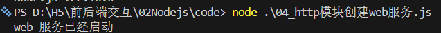
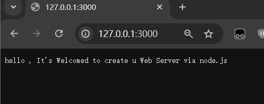

# http模块-创建web服务   

- 需求:创建web服务并响应内容给浏览器  

步骤 
1. 加载http模块,创建web服务器  
2. 监听request请求事件,设置响应头和响应体
3. 配置端口号并启动Web服务  
4. 浏览器请求http://localhost:3000测试
```javascript
//第一步
const http = require('http')
const server = http.createServer()  
//第二步
server.on('request',(req,res)=>{
    //设置响应头:内容类型,普通文本；编码格式: utf-8  

    res.setHeader('Content-Type','text/plain;charset=utf-8')  

    //设置响应内容,结束本次请求与响应
    res.end('您好,欢迎使用node.js创建web服务')


})
//第三步 让服务器监听3000端口
server.listen(3000,()=>{
    console.log('web服务已启动,监听3000端口中')
})
```
运行js文件 
  


然后通过浏览器访问本机ip中我们开启的3000端口号:



