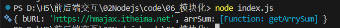

## Node.js中的模块化  
- Node.js中什么是模块化?
  每个文件都是独立模块  
- 模块之间如何联系呢? 
   使用特定语法,导入和导出使用
- CommonJS标准规定
    导出: module.exports ={} 
    导入: require('模块名称') 
- 模块名/路径如何选择? 
    内置模块直接写名字
    自定义模块写文件路径
## CommonJS标准 如何导出和导入模块呢? 
   

- 需求:定义utils.js模块,封装基地地址和求数组总和的函数  

使用: 
1. 导出:module.exports = {}  
```javascript
const baseURL = 'https://hmajax.itheima.net' 
const getArrySum = arr => arr.reduce((sum,val)=>sum+=val,0)

module.exports = {
    对外属性名1:baseURL,
    对外属性名2:getArrySum
}
```
2. 导入:require('模块名或路径')
```javascript
const obj = require('模块名或路径')
//obj 就等于module.exports 导出的对象
```


模块名或路径:
- [x] 内置模块:直接写名字(例如:fs,path,http)
- [x] 自定义模块:写模块文件路径(例如:./utils.js)


##  实例  
**util.js**
```javascript
const baseURL = 'https://hmajax.itheima.net'
const getArrySum = (arr)=>{
    return arr.reduce((prev,current)=>{
        return prev + current
    },0)
}
module.exports={
    bURL : baseURL,
    arrSum:getArrySum
}
```
**index.js**
```javascript
const obj = require('./util.js')  

console.log(obj)

```
**终端输出结果**

> 可以看到正确读取到了模块  
