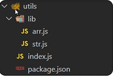

# 包的概念  

包:将模块,代码,其它资料聚合成一个文件夹

  

> 如上图的utils就是一个包,主入口就是index.js    


## 包分类: 
- 项目包:主要用于编写项目和业务逻辑 
- 软件包:  封装工具和方法进行使用 

**要求:根目录中,必须有package.json文件(记录包的清单信息)**  

## package.json的常见写法   
```json
{
    "name":"cz_utils", //软件包名称  
    "version":"1.0.0", //软件包当前版本  
    "description":"一个数组和字符串常用工具方法的包",    
    "main":"index.js",//软件包入口    
    "author":"nikofox",//软件包作者  
    "license":"xxx" //软件包许可证(商用后可以用作者名字宣传)
}
```
**注意:导入软件包时,引入的默认是index.js模块文件/main属性指定的模块文件**

需求:封装数组求和函数的模块,判断用户名和密码长度函数的模块,形成一个软件包   


