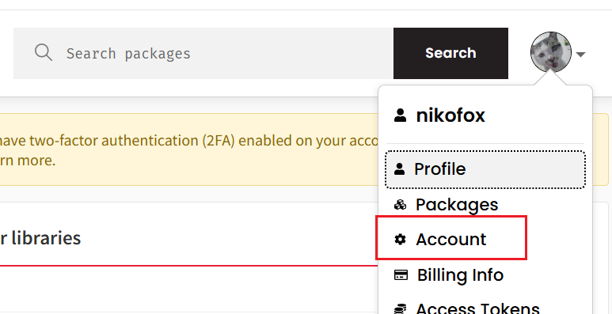
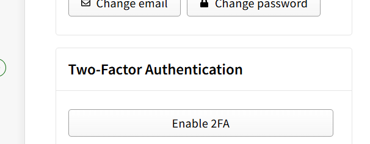
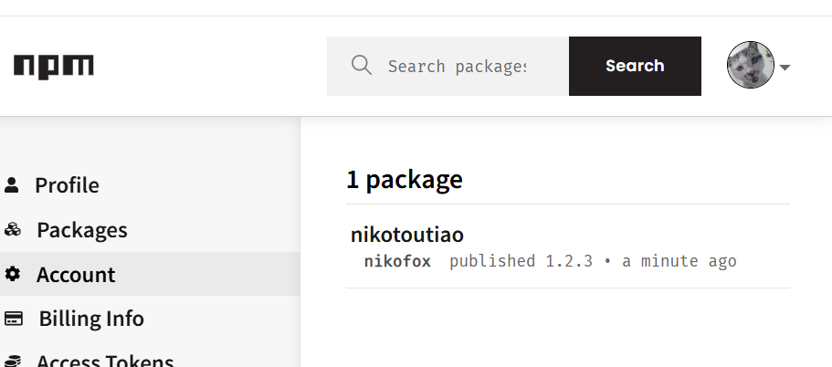
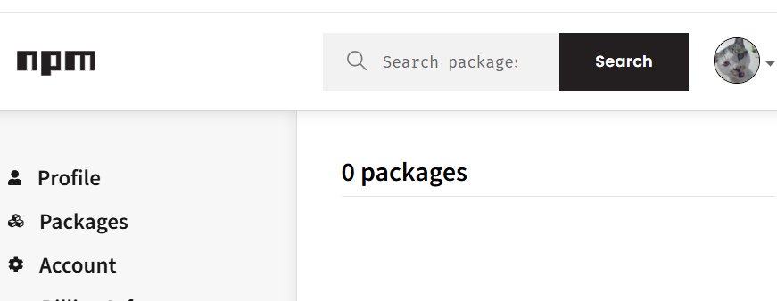

# npm发布包与删除包 
1. 注册npm并在终端登录  

[npm官网链接](https://www.npmjs.com/)
```bash
npm login
```

**注意,登录可能会报错‘Public registeration is not allower’**  

那么只需要我们在命令行执行
```bash
npm config set registery https://registry.npmjs.org
```

自己的包构建好之后   
把终端切换到包的根目录之后,运行`npm publish`命令,  
即可将包发布到npm,注意名称不可雷同  


如果遇到包名称雷同的问题,那么需要修改package.json中的name字段   

如果提示
```bash
 You cannot publish over the previously published versions
 ``` 

 那就是版本有问题,我们需要改一下package.json的版本号即可
 

 ---- 
 但是,现在(2026年),发布的时候规则变了,强制设置2FA,只有设置2步认证的才可以发布   

 

 

 配置完成之后再npm  publish  

  
可以看到发布成功😉😉😉😉😉😉
 2. 取消发布       

 删除已发布的包 
 运行`npm unpublish 包名 --force` 命令,即可从npm删除已经发布的包  

 ```bash
 npm unpublish nikotoutiao --force
 ```

     

 这样就取消发布已经发布的包了😺😺😺😺  

 ❗❗❗❗需要注意的是,
 - 这个命令智能删除72小时之内发布的包超出72小时的将不能用这样的方式删除   
 -  npm unpublish删除的包,在24小时之内不允许重复发布