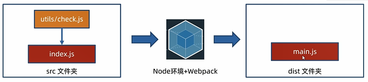
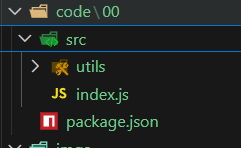
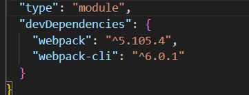
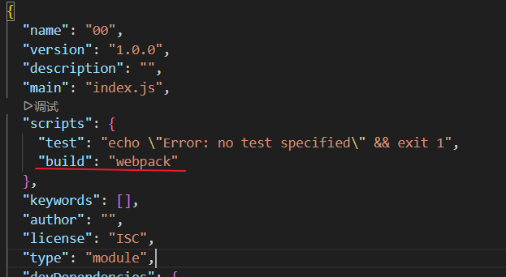
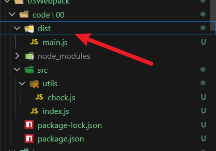

# webpack简介与体验  
定义:
本质上,webpack是一个用于现代js应用程序的静态模块打包工具,当webpack处理应用程序时  
它会在内部从一个或多个入口点构建一个依赖图,然后将项目中所需的每一个模块组合成一个或
多个bundles,它们均为静态资源,用于展示你的内容 

**静态模块** :指的是编写代码过程中的html,css,js,图片等固定内容的文件 

**打包**:把静态内容,压缩,整合,转译等(前端工程化)
- [x] 把less/sass转成css代码
- [x] 把ES6+降级为ESS代码
- [x] 支持多种模块标准语法  


## 使用webpack
需求:封装utils包,校验手机号长度和验证码长度,在src/index.js中使用并打包观察 

步骤:
1.新建并初始化项目,编写业务源代码
```bash
npm init -y
```
2.下载webpack webpack-cli到当前项目中(版本独立),并配置局部自定义命令  
```bash
npm i webpack webpack-cli --save-dev
```
下载成功后要到package.json中添加如下内容
```json
"scripts":{
    "build":"webpack"
}
```



--- 
小案例  

  
- 新建并初始化00  
```bash
PS D:\H5\前后端交互\03Webpack\code> cd 00
PS D:\H5\前后端交互\03Webpack\code\00> ls
```

- 然后创建src文件夹并创建index.js以及utils文件夹并在其中 创建用于校验号码长度和验证码长度的俩函数   

采用命名导出的ECMAScript标准,所以要在package.json中修改type为module并添加build为webpack
```json
{
  "name": "00",
  "version": "1.0.0",
  "description": "",
  "main": "index.js",
  "scripts": {
    "test": "echo \"Error: no test specified\" && exit 1",
    "build":"webpack"
  },
  "keywords": [],
  "author": "",
  "license": "ISC",
  "type": "module"
}

```
```javascript
export const checkphone = (phone)=>{
    return phone.length === 11
}

export const checkCode = (code)=>{
    return code.length === 6
}
```

- 然后在index中进行导入,运行并查看输出
```javascript
import { checkCode,checkphone }  from "./utils/check.js";  

console.log(checkphone('15588756256'))
console.log(checkCode('happy.'))
```

- 运行并查看
```bash
PS D:\H5\前后端交互\03Webpack\code\00\src> node .\index.js
true
true
```

- 准备webpack环境
```bash
npm i  webpack webpack-cli --save-dev
```

    
运行安装后可以看到package.json中多出了我们安装的包  
由于我们加了`--save-dev`所以是会自动添加为`devDependencies`的  

- 然后运行自定义命令,我们刚才配置的package.json中的是build

所以我们的命令是     
```bash
npm run build
```
```bash
18 packages are looking for funding   
orphan modules 241 bytes [orphan] 1 module
./src/index.js + 1 modules 459 bytes [built] [code generated]

WARNING in configuration
The 'mode' option has not been set, webpack will fallback to 'production' for this value.
Set 'mode' option to 'development' or 'production' to enable defaults for each environment.
You can also set it to 'none' to disable any default behavior. Learn more: https://webpack.js.org/configuration/mode/

webpack 5.105.4 compiled with 1 warning in 1111 ms
PS D:\H5\前后端交互\03Webpack\code\00\src>
```

- 然后项目目录下就生成了dist 
  
下面还有个main.js

```javascript
(()=>{"use strict";console.log(!0),console.log(!0)})();
```
给我们做了极致的压缩