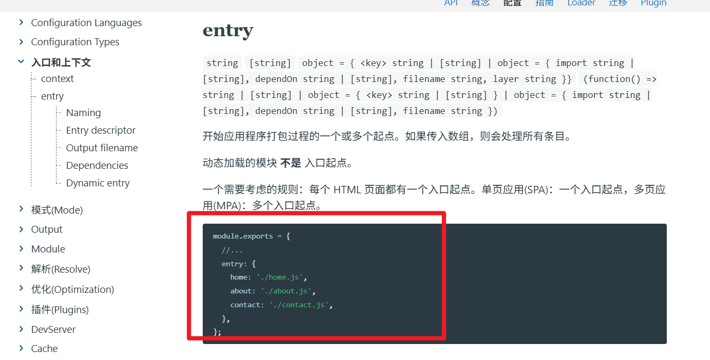
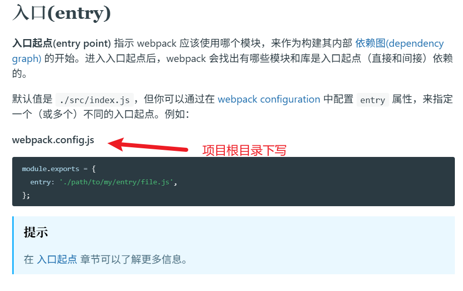
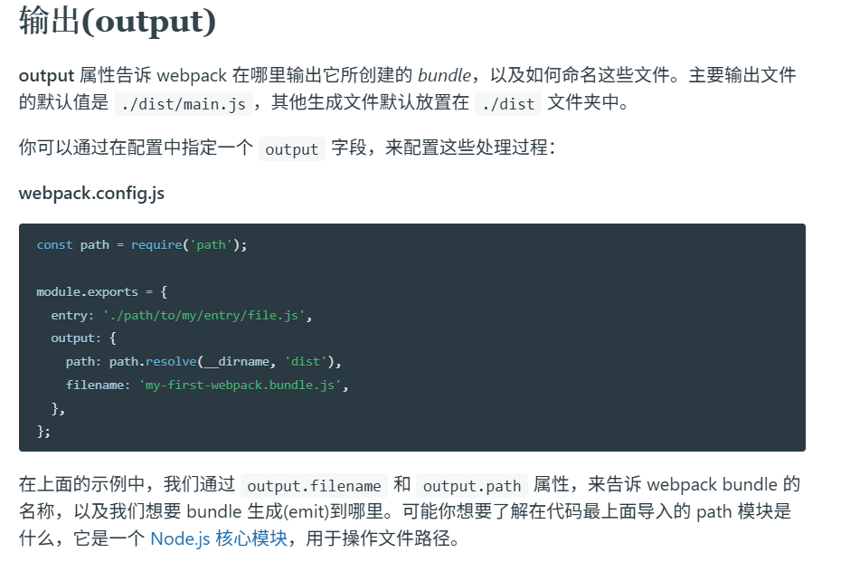
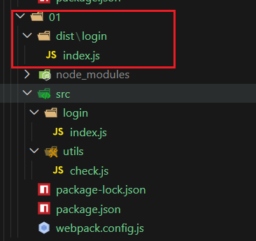

# 修改Webpack打包入口和出口  
因为默认的是src文件夹下面的index.js  
  
[webpack配置](https://www.webpackjs.com/configuration/):影响webpack打包过程和结果  

  

**入口**
可以看到入口文档的修改方式   
> 我们可以在CommonJS标准的默认导出的时候  
> 选择一个或多个入口起点  



**出口**  
 

--- 
总结步骤   

1. 项目根目录下新建webpack.config.js配置文件  

2. 导出配置对象,配置入口,出口文件的路径  

3. 重新打包观察 
**注意：只有入口产生直接/间接的引入关系,才会被打包**  


--- 
案例  

1. 在01文件夹中
```bash
PS D:\H5\前后端交互\03Webpack\code\01> npm init -y
Wrote to D:\H5\前后端交互\03Webpack\code\01\package.json:

{
  "name": "01",
  "version": "1.0.0",
  "description": "",
  "main": "webpack.config.js",
  "scripts": {
    "test": "echo \"Error: no test specified\" && exit 1"
  },
  "keywords": [],
  "author": "",

```
2. npm安装所需要的包   
```bash
PS D:\H5\前后端交互\03Webpack\code\01> npm  i webpack webpack-cli --save-dev

added 116 packages in 12s

18 packages are looking for funding
  run `npm fund` for details
```
3. 编写/src/utils/check.js  
```javascript
const checkPhone  =  (phone)=>{
    return phone.length === 11
}

const checkCode = (code)=>{
    return code.length === 6
}

module.exports={
    checkCode,
    checkPhone
}
```

4. 创建src/login,并创建index.js用来测试我们的打包入口  
```javascript
const obj = require('../utils/check.js')   
console.log(obj.checkCode('112233'))
console.log(obj.checkPhone('16655443321'))

```

5. package.json中设置script栏目的build为webpack 

6. 根目录下编写webpack.config.js  
```javascript
const path = require('path');

module.exports = {
  entry: path.resolve(__dirname,'src/login/index.js'),
  output: {
    path: path.resolve(__dirname, 'dist'),
    filename: './login/index.js',
  },
};
```


7. 运行npm run build   

8. 然后就发现确实按照webpack.config.js中的配置给我们生成了  
在dist中的login文件夹下的index.js




9. 然后测试打包的js是否和原本的功能一致  
```bash
PS D:\H5\前后端交互\03Webpack\code\01\dist\login> node .\index.js
true
true
```

补充  
webpack.config.json中可以在输出中多加一个clean:true,这样就会覆盖(清空)上次的生成
```javascript
const path = require('path');

module.exports = {
  entry: path.resolve(__dirname,'src/login/index.js'),
  output: {
    path: path.resolve(__dirname, 'dist'),
    filename: './login/index.js',
    clean:true //❗❗❗❗webpack5.2.0以上才行
  },
};
```