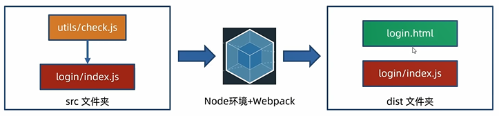

# 案例  

**完整流程**
    


代码在case/toutiao中
## 需求: 
点击登录按钮,判断手机号和验证码长度  

步骤:
1. 准备用户登录界面
2. 编写js核心代码
3. 打包并手动复制网页到dist下,引入打包后的js,运行  

核心:Webpack打包后的代码,作用在前端网页中使用  


---- 
分步   

1. 创建toutiao文件夹并`npm  init -y `

2. 创建public文件夹,放入login.html  

3. 在src/utils中编写check.js
```javascript
const checkPhone = (phone)=>{
    return phone.length === 11
}
const checkCode = (code)=>{
    return code.length === 6
}

module.exports={
    checkPhone,
    checkCode
}

//ECMAScript命名导出
// export const checkPhone = (phone)=>{
//     return phone.length === 11
// }
// export const checkCode = (code)=>{
//     return code.length === 6
// }

```

4. 在src创建login并编写index.js引入check.js
```javascript
// import  {checkPhone,checkCode} from  '../utils/check.js'
const {checkPhone,checkCode} = require('../utils/check.js')
document.querySelector('.btn').addEventListener('click',()=>{
    const phone = document.querySelector('.login-form [name="mobile"]').value
    const code = document.querySelector('.login-form [name="code"]').value

    //然后执行校验逻辑

    if(!checkPhone(phone)){
        console.log('号码格式有误')
        return //有误则阻止代码继续向下运行
    }

    if(!checkCode(code)){
        console.log('验证码长度必须为6位')
        return
    }

    console.log('提交到服务器登录')
})  
```


5. 在项目根目录创建webpack.config.js  
```javascript
const path = require('path');

module.exports = {
  entry: path.resolve(__dirname,'src/login/index.js'),
  output: {
    path: path.resolve(__dirname, 'dist'),
    filename: './login/index.js',
  },
};
```


6. `npm  i  webpack   webpack-cli --save-dev` 
然后修改package.json中的script,添加`"build":"webpack"`   


7. 全部准备完毕后运行npm run build 
```shell
PS D:\H5\前后端交互\03Webpack\case\toutiao> npm  run  build

> toutiao@1.0.0 build
> webpack
./src/utils/check.js 371 bytes [built] [code generated]
./src/utils/check.js 371 bytes [built] [code generated]

./src/utils/check.js 371 bytes [built] [code generated]

WARNING in configuration
The 'mode' option has not been set, webpack will fallb./src/utils/check.js 371 bytes [built] [code generated]
ent' or 'production' to enable defaults for each environment.
You can also set it to 'none' to disable any default behavior. Learn more: https://webpack.js.org/configuration/mode/

```
生成成功,在dist输出目录下有了login文件夹的index.js打包后js文件

8. 将public下的login.html放入dist,在其中引入dist/login/index.js 

9. 打开liveserver测试