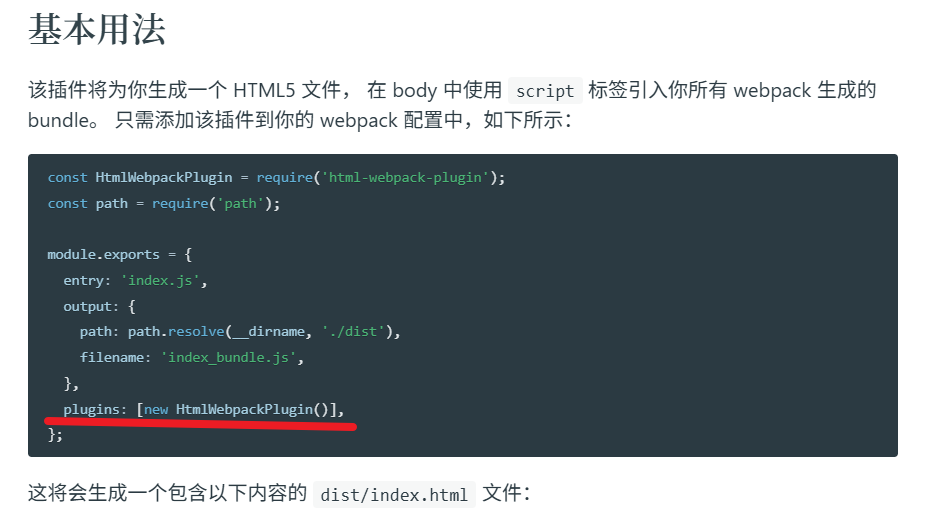

# Webpack自动生成html文件

[插件html-webpack-plugin(npm)]('https://www.npmjs.com/package/html-webpack-plugin'): 在webpack打包时生成html文件   

[备用(webpack文档链接)]('https://www.webpackjs.com/plugins/html-webpack-plugin/#root')  


  


[文档详细说明](https://github.com/jantimon/html-webpack-plugin#options)


--- 
步骤   
1. 下载html-webpack-plugin本地软件包   
```bash
npm i --save-dev html-webpack-plugin
```
2. 配置webpack.config.js让Webpack拥有插件功能   

3. 重新打包观察效果  

--- 
代码在03中


和刚才的案例比,我们把最后需要手动复制将public下的login.html放入dist,在其中引入dist/login/index.js变成了让其自动实现  

--- 
步骤总结  

1. 初始化03 
```bash
npm init -y 
```

2. 安装需要的包 
```bash
npm i webpack webpack-cli html-webpack-plugin --save-dev
```

3. 准备好public文件夹放入login.html,准备好src文件夹写login/index.js和utils/check.js  

4. 配置package.json 添加build

```javascript
{
  "name": "03",
  "version": "1.0.0",
  "description": "",
  "main": "index.js",
  "scripts": {
    "test": "echo \"Error: no test specified\" && exit 1",
    "build":"webpack"
  },
  "keywords": [],
  "author": "",
  "license": "ISC",
  "type": "commonjs",
  "devDependencies": {
    "html-webpack-plugin": "^5.6.6",
    "webpack": "^5.105.4",
    "webpack-cli": "^6.0.1"
  }
}

```

5. 配置webpack.config.js 

将插件声明并引入 

这次遇到一个小问题,强制要求我指定模式,可选的有生产模式和开发模式  
```javascript
const path = require('path')
const HtmlWebPackPlugin = require('html-webpack-plugin')

module.exports = {
    mode:"development",  //注意
    entry: path.resolve(__dirname, 'src/login/index.js'),  //入口
    output: {
        path: path.resolve(__dirname, 'dist'), 
        filename: './login/index.js'  //出口
    },
    plugins: [//然后引入我们要调用的插件
        new HtmlWebPackPlugin({
            template:path.resolve(__dirname,'public/login.html'), //模板文件
            filename: path.resolve(__dirname,'dist/login/index.html')//输出文件
        }

        )

    ]
}
```  


6. 运行npm run  build   

构建完成后发现这次不用手动复制了,而是dist中帮我们生成了需要的html文件并自动进行了引入js
 