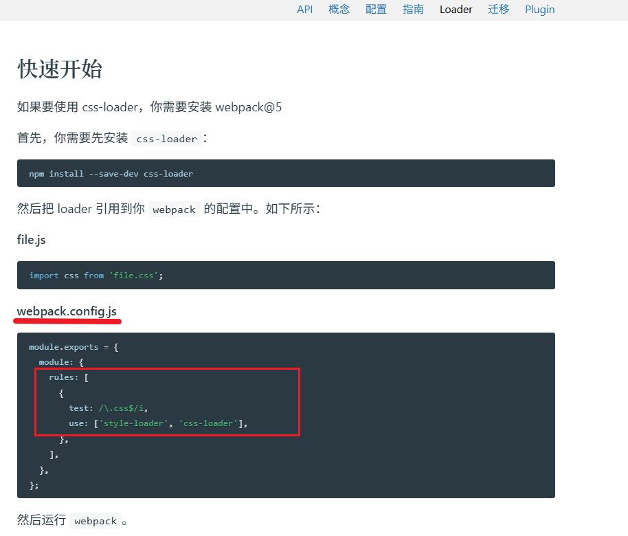

# webpack打包css代码   

注意:其实webpack默认只识别js代码


[加载器css-loader:](https://www.webpackjs.com/loaders/css-loader/#root)解析css代码  
[加载器style-loader:]()把解析后的css代码插入到DOM  

- style-loader/css-loader的使用方式  
   

就是在webpack.config.js中的module中设置规则

```javascript
module.exports = {
  module: {
    rules: [
      {
        test: /\.css$/i,
        use: ['style-loader', 'css-loader'],
      },
    ],
  },
};
```


---   
步骤 

1. 准备css文件代码引入到src/login/index.js中(压缩转译处理等)
```javascript
// import  {checkPhone,checkCode} from  '../utils/check.js'
const {checkPhone,checkCode} = require('../utils/check.js')
document.querySelector('.btn').addEventListener('click',()=>{
    const phone = document.querySelector('.login-form [name="mobile"]').value
    const code = document.querySelector('.login-form [name="code"]').value

    //然后执行校验逻辑

    if(!checkPhone(phone)){
        console.log('号码格式有误')
        return //有误则阻止代码继续向下运行
    }

    if(!checkCode(code)){
        console.log('验证码长度必须为6位')
        return
    }

    console.log('提交到服务器登录')
})  

//为了能够从本地加载bootstrap,这里补充bootstrap
//❗❗❗❗❗❗需要npm i  bootstrap

require('bootstrap/dist/css/bootstrap.min.css')
require('bootstrap/dist/js/bootstrap.min.js')

//引入css文件
require('./index.css')


```
2.  下载css-loader和style-loader本地软件包   

3. 配置webpack.config.js让webpack拥有加载器功能   


4.  打包观察


---
webpack.config.json 

```javascript
const path = require('path')
const HtmlWebPackPlugin = require('html-webpack-plugin')
module.exports = {
    mode: "production",//development模式默认不压缩html到一整行,但是production会开启压缩
    //加载器:让webpack能识别更多模块内容的代码
    module: {
        rules: [
            {
                test: /\.css$/i,
                use: ['style-loader', 'css-loader'],
            },
        ],
    },

    entry: path.resolve(__dirname, 'src/login/index.js'),
    output: {
        path: path.resolve(__dirname, 'dist'),
        filename: './login/index.js'
    },
    plugins: [//然后引入我们要调用的插件
        new HtmlWebPackPlugin({
            template: path.resolve(__dirname, 'public/login.html'), //模板文件
            filename: path.resolve(__dirname, 'dist/login/index.html')//输出文件
        }

        )

    ]
}
```