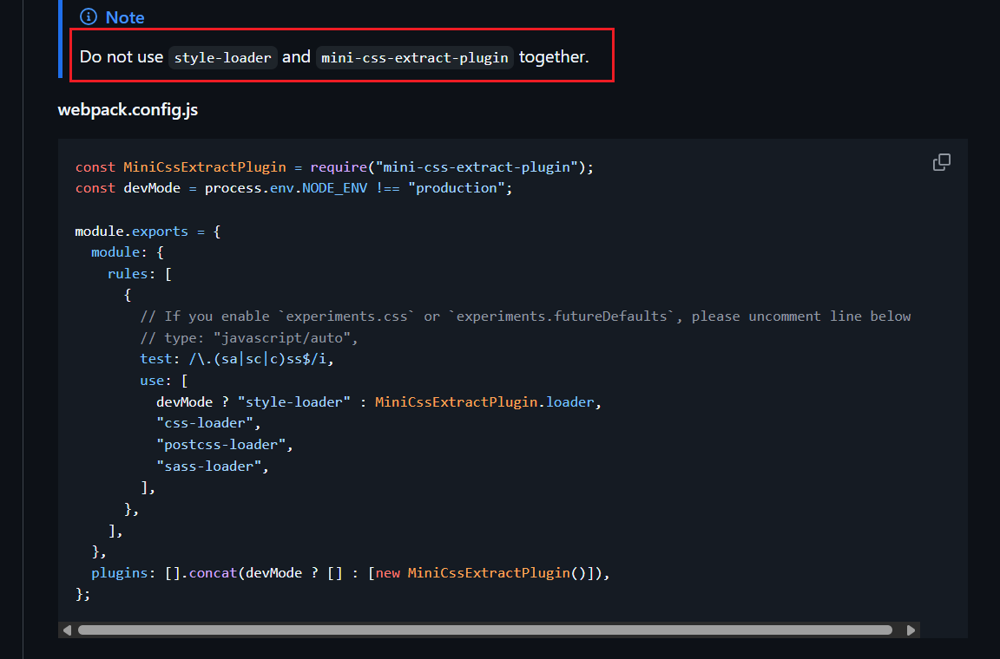
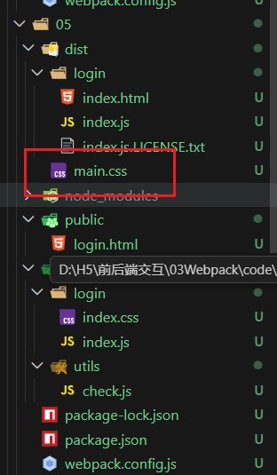

# 优化-提取css代码

[插件mini-css-extra-plugin:](https://www.webpackjs.com/plugins/mini-css-extract-plugin/#root)提取css代码  

[插件介绍链接](https://github.com/webpack/css-loader#recommend)  


  

可以看到介绍中说不能将mini-css-extra-plugin和style-loader混用  

- 使用方式
```javascript
const MiniCssExtractPlugin = require("mini-css-extract-plugin");
const devMode = process.env.NODE_ENV !== "production";

module.exports = {
  module: {
    rules: [
      {
        // If you enable `experiments.css` or `experiments.futureDefaults`, please uncomment line below
        // type: "javascript/auto",
        test: /\.(sa|sc|c)ss$/i,
        use: [
          devMode ? "style-loader" : MiniCssExtractPlugin.loader,
          "css-loader",
          "postcss-loader",
          "sass-loader",
        ],
      },
    ],
  },
  plugins: [].concat(devMode ? [] : [new MiniCssExtractPlugin()]),
};
```
---
实例    

1.  先把04的除了dist都复制一下,然后
```bash
npm i mini-css-extra-plugin  --save-dev
```  
2. 之后修改webpack.config.js
```javascript
const path = require('path')
const HtmlWebPackPlugin = require('html-webpack-plugin')
const MiniCssExtractPlugin = require("mini-css-extract-plugin");
module.exports = {
    mode: "production",//development模式默认不压缩html到一整行,但是production会开启压缩
    //加载器:让webpack能识别更多模块内容的代码
    module: {
        rules: [
            {
                test: /\.css$/i,
                use: [MiniCssExtractPlugin.loader, "css-loader"],
            },
        ],
    },

    entry: path.resolve(__dirname, 'src/login/index.js'),
    output: {
        path: path.resolve(__dirname, 'dist'),
        filename: './login/index.js'
    },
    plugins: [//然后引入我们要调用的插件
        new HtmlWebPackPlugin({
            template: path.resolve(__dirname, 'public/login.html'), //模板文件
            filename: path.resolve(__dirname, 'dist/login/index.html')//输出文件
        }

        ),
        new MiniCssExtractPlugin()  //为了生成css文件

    ]
}
```
3. 然后进行run  build  

就可以发现现在dist内多了main.css,而不再是04文件中那样写在index.js中了
