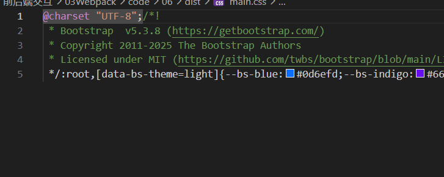

# 优化-压缩过程

问题:css代码提取后没有压缩   

[css-minimizer-webpack-plugin:](https://www.webpackjs.com/plugins/css-minimizer-webpack-plugin/#root)使用它可以进行css代码的压缩   


1.  下载
```bash
npm install css-minimizer-webpack-plugin --save-dev
```  
2. 在webpack.config.js中引入
```javascript
const MiniCssExtractPlugin = require('mini-css-extract-plugin');
const CssMinimizerPlugin = require('css-minimizer-webpack-plugin');

module.exports = {
  module: {
    rules: [
      {
        test: /.s?css$/,
        use: [MiniCssExtractPlugin.loader, 'css-loader', 'sass-loader'],
      },
    ],
  },
  optimization: {
    minimizer: [
      // 在 webpack@5 中，你可以使用 `...` 语法来扩展现有的 minimizer（即 `terser-webpack-plugin`），将下一行取消注释
      // `...`,
      new CssMinimizerPlugin(),
    ],
  },
  plugins: [new MiniCssExtractPlugin()],
};
```  

注意
这将仅在生产环境开启 CSS 优化。

如果还想在开发环境下启用 CSS 优化，请将 optimization.minimize 设置为 true:

```javascript
// [...]
module.exports = {
  optimization: {
    // [...]
    minimize: true,
  },
};
```


---  

完整的webpack.config.json配置    

```javascript
const path = require('path')
const HtmlWebPackPlugin = require('html-webpack-plugin')
const MiniCssExtractPlugin = require("mini-css-extract-plugin")

const CssMinimizerPlugin = require('css-minimizer-webpack-plugin');
module.exports = {
    mode: "production",//development模式默认不压缩html到一整行,但是production会开启压缩
    //加载器:让webpack能识别更多模块内容的代码
    module: {
        rules: [
            {
                test: /\.css$/i,
                use: [MiniCssExtractPlugin.loader, "css-loader"],
            },
        ],
    },

    entry: path.resolve(__dirname, 'src/login/index.js'),
    output: {
        path: path.resolve(__dirname, 'dist'),
        filename: './login/index.js'
    },
    optimization: {
    minimizer: [
      // 在 webpack@5 中，你可以使用 `...` 语法来扩展现有的 minimizer（即 `terser-webpack-plugin`），将下一行取消注释
      `...`,
      new CssMinimizerPlugin(),
    ],
  },
    plugins: [//然后引入我们要调用的插件
        new HtmlWebPackPlugin({
            template: path.resolve(__dirname, 'public/login.html'), //模板文件
            filename: path.resolve(__dirname, 'dist/login/index.html')//输出文件
        }

        ),
        new MiniCssExtractPlugin() , //为了生成css文件
  

    ]
}
```

run build 之后生成了dist/main.css  
已经被打包好了   


   


